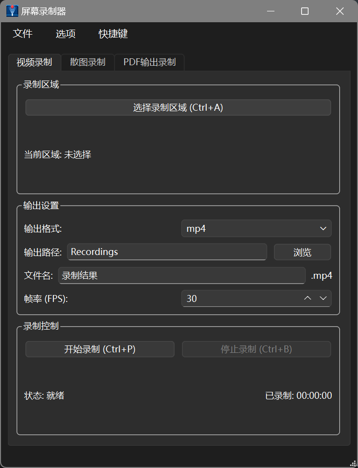
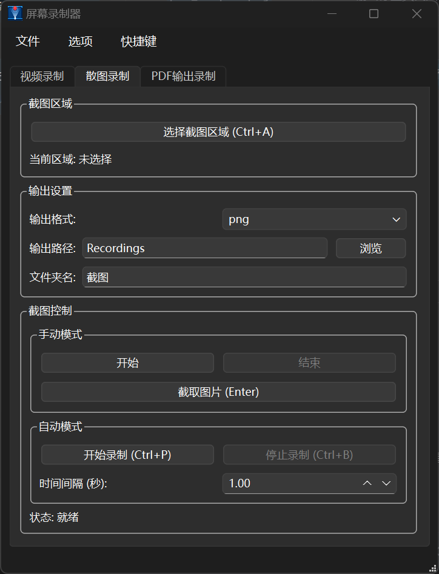
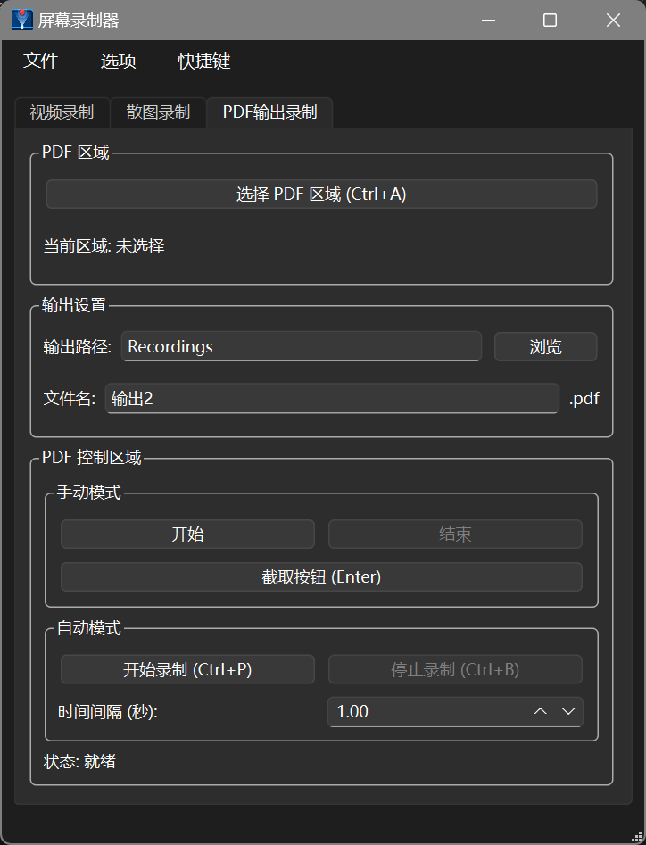

# ScreenRecorder

一个基于 PySide6 的多功能屏幕录制器，支持视频录制、散图录制和 PDF 输出。

---

## 🖼️ 界面预览


### 视频录制


### 散图录制


### PDF输出录制


---

## 功能介绍

### 视频录制
- 可选择录制区域
- 支持多种输出格式：MP4, AVI, MKV, MOV
- 可调节帧率
- 实时显示录制时长
- 快捷键支持：Ctrl+A（选区域）、Ctrl+P（开始）、Ctrl+B（停止）

### 散图录制
- 可选择截图区域
- 支持多种图片格式：PNG, JPG, BMP
- 手动模式：单次或批量截图
- 自动模式：定时自动截图
- 快捷键：Enter（截图）

### PDF 输出
- 可选择截图区域
- 手动模式：单次或批量截图后自动生成PDF
- 自动模式：定时截图自动生成PDF
- PDF页面尺寸动态适配截图
- 图片完整显示，无裁剪

### 其他特性
- 快捷键可自定义
- 设置持久化存储
- 窗口置顶功能
- 状态栏提示，不打断用户操作

## 环境要求

- Python 3.11+
- Windows 系统

## 安装依赖

```bash
pip install -r requirements.txt
```

或使用 `pyproject.toml`：

```bash
pip install .
```

## 运行项目

```bash
python mainwindow.py
```

## 打包EXE

使用 PySide6 官方打包工具：

```bash
pyside6-deploy mainwindow.py
```

打包后的文件位于项目根目录。

## 配置文件说明

### 数据存储位置
- **配置文件目录**：`%AppData%\ScreenRecorder`
- **设置文件**：`settings.json`（快捷键配置等）
- **默认的录制文件输出目录**：`%AppData%\ScreenRecorder\Recordings`

### 配置文件内容
```json
{
    "shortcuts": {
        "select_region": "Ctrl+A",
        "start_recording": "Ctrl+P",
        "stop_recording": "Ctrl+B",
        "capture_image": "Return"
    }
}
```

### 特性
- ✅ 首次运行自动创建配置目录
- ✅ 关闭时自动保存设置
- ✅ 下次运行时自动加载上次设置

## 项目结构

```
screen_recoder/
├── mainwindow.py       # 主程序
├── form.ui            # UI设计文件
├── ui_form.py         # 自动生成的UI代码
├── pyproject.toml     # 项目配置
├── requirements.txt   # 依赖列表
├── screen.ico         # 应用图标
├── screenshots/       # 界面截图文件夹
│   ├── main_window.png
│   ├── select_region.png
│   ├── video_recording.png
│   ├── image_capture.png
│   └── pdf_output.png
├── README.md          # 项目说明
└── LICENSE            # 许可证
```

## 技术栈

- **GUI框架**：PySide6 (Qt6)
- **屏幕捕获**：mss, Qt原生截图
- **视频处理**：OpenCV
- **PDF生成**：ReportLab
- **图像处理**：Pillow, NumPy

## 许可证

MIT License
